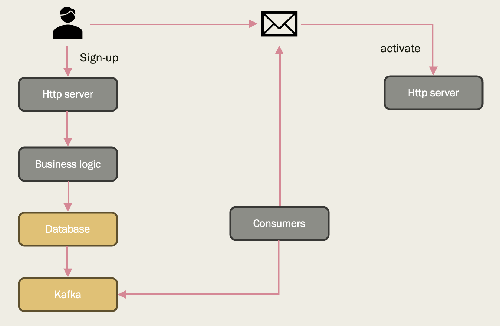
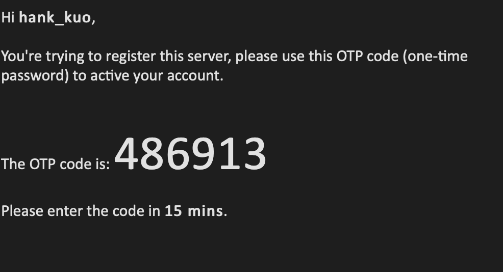
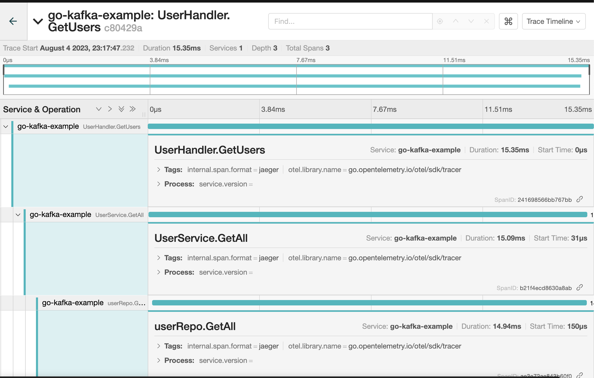
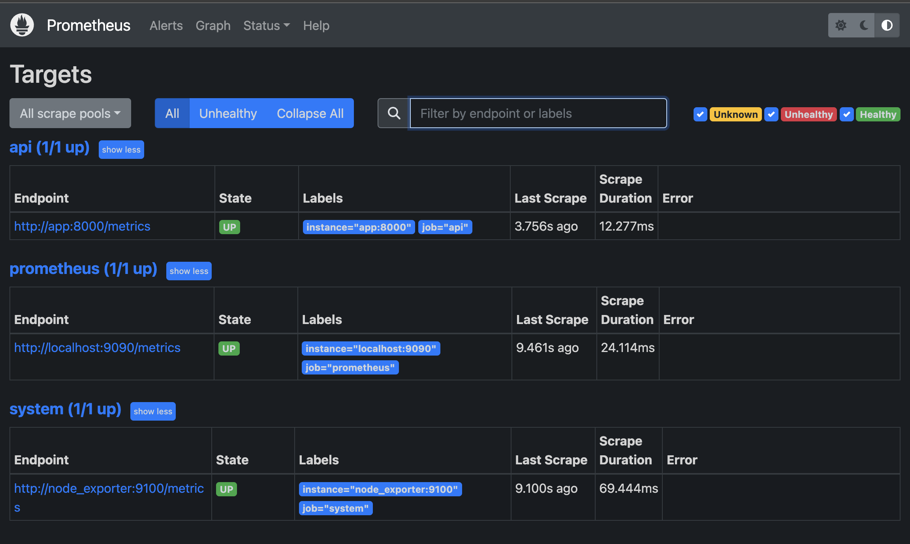
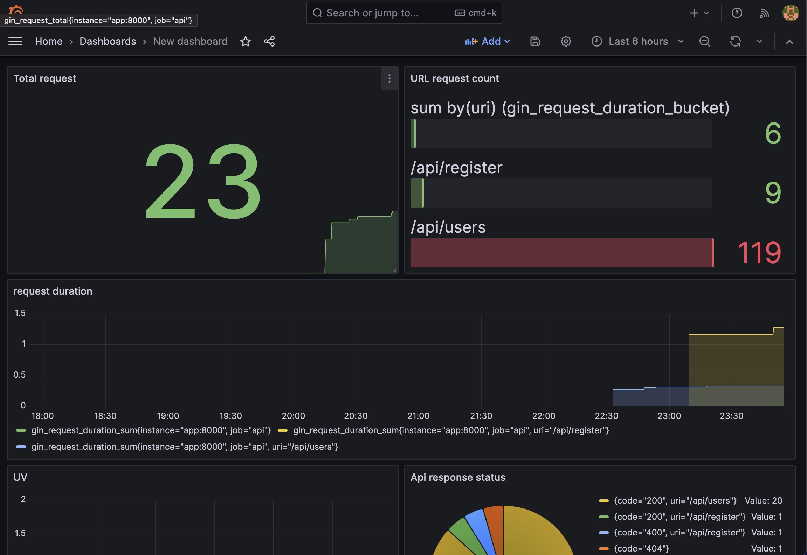
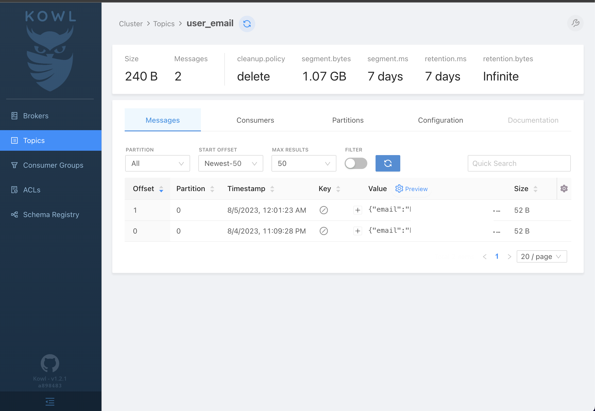

# GO-KAFAK-EXAMPLE
## Library 
- kafka: wurstmeister/kafka
- zookeeper: wurstmeister/zookeeper
- kowl: UI dashboard for kafka
- postgesql: Relation database
- prometheus: monitor & alert tool
- node_exporter
- grafana: UI dashboard
- jaeger: trace serve request 
- gin: go http server
- go-kakfa: go kafka's third-party lib 
- go-migrate: db migration lib
- sqlx: go db third-party lib
- viper: go config lib 
- fastAPI: python http server
- confluent-kafka: python third-party lib
- poetry: python lib management

## API
Build up auth/user system that can register and login.
If user sign up, the system will send a verification code's mail to your mail.

Listen in http://localhost:8000/api

provide http APIs:
- /healthz
- /login
- /register
- /activate
- /users
- /send_email

```bash
make run-producer
make run-consumer [Not Done]
make py-consumer
make py-producer [Not Done]
make docker-up
make docker-down
```
Screenshot





**Stress testing**
stress testing for http `/users` api 

Using thread: 4, connect: 4

<pre>
QPS      50%     75%     90%      99% 
1349.12  1.89ms  7.23ms  16.11ms  32.82ms
</pre>

stress testing for grpc `/users` api 

<pre>
QPS      50%     75%     90%      99% 

</pre>

## Jaeger
Tracing service

Host: http://localhost:16686

Screenshot


## Prometheus
Metrics for monitoring server

Host: http://localhost:9090

Screenshot


## Grafana
Dashboard for visualizing metrics

Host: http://localhost:3001

Screenshot


## Kafka
Using wurstmeister/zookeeper, wurstmeister/kafka

- zookeeper: http://localhost:2181
- kafka: http://localhost:9092


## Kowl
UI dashboard for kakfa

Host: http://localhost:8080

Screenshot


- grpc middleware ... and tracing !? 

